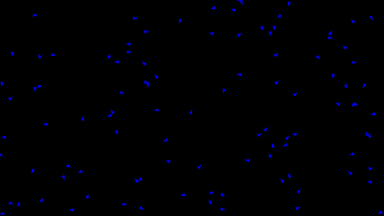

# booooids
My attempt at a C++ implementation of the flocking behaviour described by [Craig Reynolds](https://www.red3d.com/cwr/boids/). 

To compile you will need CMake and the [SFML](https://www.sfml-dev.org/) library installed.

